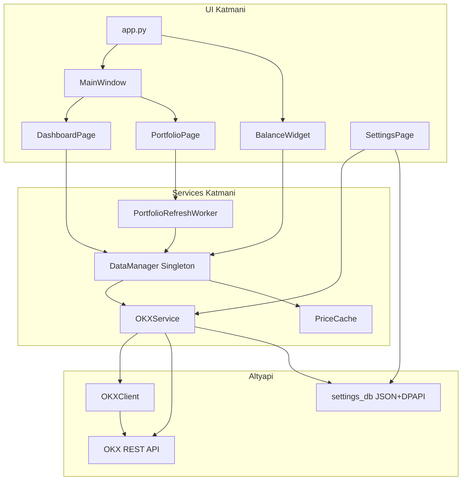

# CryptoDesk Proje Analizi

## Genel Bakış

CryptoDesk, OKX Spot hesabındaki kripto varlıkları Windows masaüstünden izlemek için geliştirilen profesyonel bir uygulamadır. Proje küçük (18 kaynak dosyası) ama katmanlı mimari bilinçli şekilde uygulanmıştır.

---

## Klasör Yapısı

```
CryptoDesk/
├── app.py                  # Giriş noktası + BalanceWidget
├── api/
│   └── okx_client.py       # OKX REST imzalama ve bağlantı testi
├── database/
│   └── settings_db.py      # API ayarları okuma/yazma (JSON + DPAPI)
├── security/
│   └── dpapi.py            # Windows DPAPI şifreleme
├── services/
│   ├── data_manager.py     # Merkezi veri yöneticisi (Singleton)
│   ├── data_worker.py      # Arka plan thread worker
│   ├── okx_service.py      # OKX iş mantığı (bakiye, fiyat)
│   └── price_cache.py      # Bellek içi fiyat önbelleği
├── ui/
│   ├── main_window.py      # Ana pencere + sol menü
│   ├── dashboard.py        # Toplam portföy kartı
│   ├── portfolio.py        # Varlık tablosu + otomatik yenileme
│   ├── watchlist.py        # İskelet (henüz işlev yok)
│   ├── alarms.py           # İskelet (henüz işlev yok)
│   └── settings.py         # OKX API ayarları
├── PROJECT_CONTEXT.md      # Proje özeti ve kurallar
├── DEVELOPMENT.md          # Geliştirme standartları (untracked)
├── ROADMAP.md              # Sürüm planı (v0.3 → v1.0)
└── .gitignore
```

**Not:** Dokümantasyonda SQLite geçse de, şu an yalnızca API anahtarları `%LOCALAPPDATA%\CryptoDesk\config.json` dosyasında DPAPI ile şifrelenmiş olarak saklanıyor. SQLite henüz kullanılmıyor.

---

## Kullanılan Teknolojiler

| Katman | Teknoloji | Kullanım |
|--------|-----------|----------|
| Dil | Python 3.14 | Tüm uygulama |
| UI | PySide6 (Qt6) | Pencere, widget, sinyal/slot, QThread |
| API | OKX REST v5 | Bakiye, fiyat, hesap doğrulama |
| HTTP | `requests` | Doğrudan OKX endpoint çağrıları |
| Güvenlik | `pywin32` (win32crypt) | Windows DPAPI ile API key şifreleme |
| Depolama | JSON dosyası | Ayarlar (SQLite planlanmış, henüz yok) |
| Thread | QThread | UI bloklamadan portföy yenileme |

**Eksik altyapı:** `requirements.txt`, `pyproject.toml`, test framework'ü veya CI yapılandırması bulunmuyor.

---

## Mimari ve Veri Akışı



**Temel kural:** UI → DataManager → Services → API/Database. Bu kural Portfolio ve Dashboard'da doğru uygulanmış.

**İstisna:** [`ui/settings.py`](ui/settings.py) doğrudan `OKXService` ve `load_settings()` kullanıyor; mimari kurala kısmen aykırı.

---

## Önemli Dosyalar

### Giriş ve kabuk
- [`app.py`](app.py) — Uygulama başlatma, `DataManager` oluşturma, `MainWindow` + yüzen `BalanceWidget` (sürüklenebilir, gizlenebilir toplam bakiye)

### Merkezi veri katmanı
- [`services/data_manager.py`](services/data_manager.py) — Singleton; `portfolio_updated` / `portfolio_error` sinyalleri; tek veri kaynağı
- [`services/okx_service.py`](services/okx_service.py) — Funding + Trading bakiyelerini birleştirir, USDT değerlerini hesaplar, 15 sn fiyat cache kullanır
- [`services/price_cache.py`](services/price_cache.py) — Thread-safe bellek cache (RLock)
- [`services/data_worker.py`](services/data_worker.py) — `QThread` ile arka planda `refresh_portfolio()`

### API ve güvenlik
- [`api/okx_client.py`](api/okx_client.py) — HMAC-SHA256 imzalama, bağlantı testi
- [`database/settings_db.py`](database/settings_db.py) — `%LOCALAPPDATA%\CryptoDesk\config.json`
- [`security/dpapi.py`](security/dpapi.py) — Windows'a özel şifreleme

### UI sayfaları (olgunluk)
| Dosya | Durum |
|-------|-------|
| [`ui/main_window.py`](ui/main_window.py) | Tam — 5 sayfalık navigasyon |
| [`ui/dashboard.py`](ui/dashboard.py) | Tam — portföy özeti |
| [`ui/portfolio.py`](ui/portfolio.py) | Tam — tablo, dust filtresi, 30 sn auto-refresh, thread |
| [`ui/settings.py`](ui/settings.py) | Tam — API kaydet/test |
| [`ui/watchlist.py`](ui/watchlist.py) | İskelet — sadece başlık |
| [`ui/alarms.py`](ui/alarms.py) | İskelet — sadece başlık |

### Dokümantasyon
- [`PROJECT_CONTEXT.md`](PROJECT_CONTEXT.md) — Mimari kurallar ve tamamlanan özellikler
- [`DEVELOPMENT.md`](DEVELOPMENT.md) — Kod/UI/performans standartları
- [`ROADMAP.md`](ROADMAP.md) — v0.3 (Watchlist, Alarm, Tray) → v1.0 (EXE)

---

## Tamamlanan Özellikler

- OKX Funding + Trading hesap birleştirme
- Anlık spot fiyat çekme ve USDT değer hesabı
- Dashboard toplam portföy gösterimi
- Portfolio tablosu (sıralama, dust filtresi)
- 30 saniyede otomatik yenileme (Portfolio sayfası)
- Thread ile UI bloklamayan veri çekme
- Yüzen Balance Widget (always-on-top, sürüklenebilir, gizlenebilir)
- DPAPI ile güvenli API key saklama
- OKX bağlantı testi ve izin kontrolü

---

## Tespit Edilen Zayıf Noktalar

1. **Dashboard ilk yükleme:** Dashboard yalnızca sinyal dinliyor; uygulama açılışında portföy yenilemesini Portfolio sayfası tetikliyor. Dashboard tek başına açık kalırsa "Bekleniyor..." görünebilir.
2. **Mimari tutarsızlık:** Settings doğrudan `OKXService` kullanıyor; `DataManager.reconnect()` ve `refresh_client()` zaten mevcut.
3. **OKXClient kapsamı:** [`okx_service.py`](services/okx_service.py) içinde birçok HTTP çağrısı `requests.get` ile doğrudan yapılıyor; imzalı istekler `OKXClient._headers` üzerinden, public ticker ise client dışında.
4. **Bağımlılık yönetimi:** `requirements.txt` yok; kurulum için PySide6, requests, pywin32 manuel kurulmalı.
5. **BalanceWidget konumu:** UI bileşeni [`app.py`](app.py) içinde; modülerlik için `ui/` altına taşınabilir (gelecek refactor).
6. **Hata yönetimi:** Portfolio hataları `print()` ile loglanıyor; merkezi logging yok.
7. **SQLite:** Dokümanda var, kodda yok; Watchlist/Alarm için gerekli olacak.

---

## Geliştirme Önerileri

### Kısa vade (v0.3 — ROADMAP ile uyumlu)

1. **Watchlist**
   - SQLite tablosu: `watchlist(coin, added_at)`
   - `DataManager`'a `watchlist_updated` sinyali ve cache'ten fiyat okuma
   - UI: coin ekleme/çıkarma, anlık fiyat listesi

2. **Alarm sistemi**
   - SQLite: `alarms(coin, condition, target_price, active)`
   - Arka plan kontrolü: mevcut 30 sn refresh döngüsüne entegre veya ayrı timer
   - Windows bildirimi (QSystemTrayIcon — ROADMAP'teki Tray Icon ile birlikte)

3. **Settings mimari düzeltmesi**
   - `SettingsPage` → `DataManager.reconnect()` kullanmalı; test bağlantısı için DataManager'a ince bir metot eklenebilir

4. **Dashboard başlangıç yenilemesi**
   - `MainWindow` veya `DashboardPage` açılışta bir kez `PortfolioRefreshWorker` tetiklemeli

### Orta vade (v0.4–v0.5)

5. **Grafikler ve portföy geçmişi** — Periyodik snapshot kaydı (SQLite), basit çizgi grafik (Qt Charts veya lightweight kütüphane)
6. **WebSocket canlı fiyat** — OKX public WS; yalnızca watchlist coin'leri için abonelik; REST fallback korunmalı
7. **OKXClient konsolidasyonu** — Tüm HTTP çağrıları tek client sınıfından geçmeli

### Uzun vade (v1.0)

8. **PyInstaller paketleme** — `.gitignore`'da `build/`, `dist/`, `*.spec` zaten hazır
9. **Otomatik güncelleme** — GitHub Releases tabanlı basit sürüm kontrolü

### Altyapı ve kalite

10. **`requirements.txt` ekle**
    ```
    PySide6
    requests
    pywin32
    ```
11. **Merkezi logging** — `logging` modülü; API key/passphrase asla loglanmamalı
12. **DEVELOPMENT.md'yi git'e ekle** — Şu an untracked durumda
13. **Singleton netliği** — `DataManager` hem `app.py` hem `MainWindow`'da instantiate ediliyor; çalışıyor ama tek giriş noktası (`app.py`) tercih edilebilir
14. **Test stratejisi** — `PriceCache`, `OKXClient._headers` imzalama ve portfolio hesaplama için unit test; mock HTTP ile OKXService

---

## Özet Değerlendirme

Proje **küçük, odaklı ve genişletilebilir** bir temele sahip. Katmanlı mimari ve thread kullanımı doğru düşünülmüş. En acil ihtiyaçlar: bağımlılık dosyası, Dashboard ilk yükleme, Settings mimari uyumu ve ROADMAP'teki v0.3 özellikleri (Watchlist, Alarm, Tray). SQLite entegrasyonu bir sonraki büyük adım olacak.
